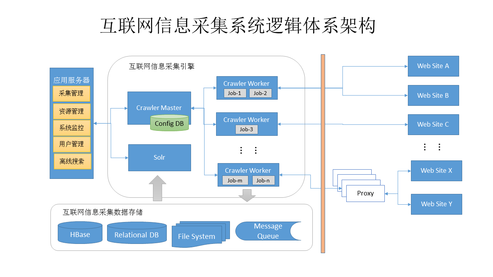

<head><title>基于Scrapy框架的分布式精确爬虫</title></head>

# 需求

1. 完全通过配置的方式定义需要抓取的内容及抓取的方式，不需要开发任何程序。
1. 以结构化的方式存储从网页中解析的内容，支持多种存储方式。
1. 提供已抓取网页的离线解析功能。
1. 支持通过代理方式抓取网页。
1. 提供对抓取结果的搜索功能。
1. 支持集群，提供系统性能的水平扩展能力。

# 体系架构

# 总体设计

## Scrapy框架简介

> An open source and collaborative framework for extracting the data you need from websites.
In a fast, simple, yet extensible way.

### Scrapy系统架构

> The data flow in Scrapy is controlled by the execution engine, and goes like this:
> 1. The Engine gets the initial Requests to crawl from the Spider.
> 1. The Engine schedules the Requests in the Scheduler and asks for the next Requests to crawl.
> 1. The Scheduler returns the next Requests to the Engine.
> 1. The Engine sends the Requests to the Downloader, passing through the Downloader Middlewares (see process_request()).
> 1. Once the page finishes downloading the Downloader generates a Response (with that page) and sends it to the Engine, passing through the Downloader Middlewares (see process_response()).
> 1. The Engine receives the Response from the Downloader and sends it to the Spider for processing, passing through the Spider Middleware (see process_spider_input()).
> 1. The Spider processes the Response and returns scraped items and new Requests (to follow) to the Engine, passing through the Spider Middleware (see process_spider_output()).
> 1. The Engine sends processed items to Item Pipelines, then send processed Requests to the Scheduler and asks for possible next Requests to crawl.
> 1. The process repeats (from step 1) until there are no more requests from the Scheduler.

基于Scrapy实现的爬虫系统可以通过实现自己的Downloader、Spider和Item Pipeline来实现抓取、解析和内容存储功能的定制化。

## 抓取功能

## 页面在线解析

## 解析结果保存

## 抓取配置

## 分布式作业部署

## 抓取作业调度

# 功能模块
